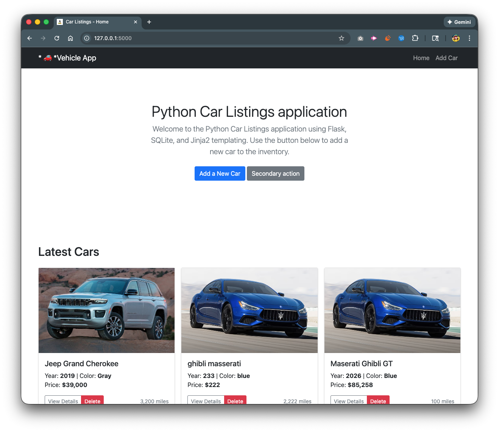

# Flask Application

## Overview

This Flask application provides a web-based interface for various functionalities. The application is built using Python and the Flask web framework.



_Sample screenshot showing what to expect from the car listing application interface_

## Requirements

- Python 3.7 or higher
- Flask
- Additional dependencies (see requirements.txt)

## Running the app off the shelf

The greatest update I've made to this app is the ability to run this within Docker. Yes, this is already dockerized and ready to use. You can add the pipeline process for any cloud hosting platform Azure or AWS, your choice.

Let's get started, to run Docker, you first have to have Docker installed in your machine. If you don't have Docker, go to docker.com and install it. After that, you have to have it running. Then, clone this repo and go to the place where you have it installed. In your terminal, go that same location and run the following:
`docker compose up -d`

that will start the website at: [http://localhost:8000/](http://localhost:8000/)
it will run the docker build if necessary to run the image.
`docker build`
If you want to contribute to this repository, contact me or fork the build and I will catch it. I hope you like this app.

## Installation

1. Clone the repository:bash
   git clone <repository-url>
   cd <project-directory>
2. Create a virtual environment:

# Creating a Python Virtual Environment for Development and Production Deployment

# DEVELOPMENT SETUP:

1. Create a virtual environment using venv (Python 3.3+):

`python -m venv env`

2. Alternative using virtualenv (if installed):

`virtualenv env`

3. Activate the virtual environment:

On Windows: `env\Scripts\activate`
On macOS/Linux:
`source env/bin/activate`

4. Install dependencies:

`pip install -r requirements.txt`

5. Run the Flask application in development mode:

`export FLASK_ENV=development # On Windows: set FLASK_ENV=development`

`flask run`

Or: python app.py

# PRODUCTION DEPLOYMENT:

1. Prepare production requirements.txt with pinned versions:
   `pip freeze > requirements.txt`

2. Set up production server (example with Ubuntu/Debian):
   `sudo apt update`
   `sudo apt install python3 python3-venv python3-pip`

3. Create production virtual environment:
   `python3 -m venv /var/www/flask_app/venv`
   `source /var/www/flask_app/venv/bin/activate`

4. Install production dependencies:
   `pip install -r requirements.txt`
   `pip install gunicorn # WSGI server for production`

5. Set production environment variables:

```python
export FLASK_ENV=production
export FLASK_APP=app.py
```

6. Run with Gunicorn (production WSGI server):

`gunicorn --bind 0.0.0.0:8000 app:app`

7. Optional: Set up reverse proxy with Nginx:
   Configure Nginx to proxy requests to Gunicorn
   Create systemd service for automatic startup

8. For containerized deployment with Docker:

Create Dockerfile with virtual environment setup
Use multi-stage builds for optimized production images

# BEST PRACTICES:

- Always use virtual environments to isolate dependencies
- Pin dependency versions in requirements.txt for production
- Use environment variables for configuration
- Never run Flask development server in production
- Use proper WSGI servers like Gunicorn or uWSGI for production
- Implement proper logging and monitoring in production

## How to use the mypython.py file

you can run some scenarios to help you get started

```python
# Create a CarManager instance
garage = CarManager()

# Create some Car instances
car1 = Car("Toyota", "Camry", 2020, "Blue")
car2 = Car("Honda", "Civic", 2019, "Red")
car3 = Car("Ford", "Mustang", 2021, "Black")

# Add cars to the garage
garage.add_car(car1)
garage.add_car(car2)
garage.add_car(car3)

# List all cars in the garage
garage.list_cars()

# Start some cars
car1.start()
car3.start()

# List cars again to see running status
garage.list_cars()

# Find a specific car
found_car = garage.find_car("Honda", "Civic")
if found_car:
    print(f"\nFound car: {found_car}")
    found_car.start()

# Stop a car
car1.stop()

# Remove a car from the garage
garage.remove_car(car2)

# Final list of cars
garage.list_cars()
```

you can copy the above code snippet, this creates an instance of the CarManager() and this lets you add sample cars. You can then open your terminal and run the file 'pip mysample.py' or you can place the sample code below the mypython.py file.
